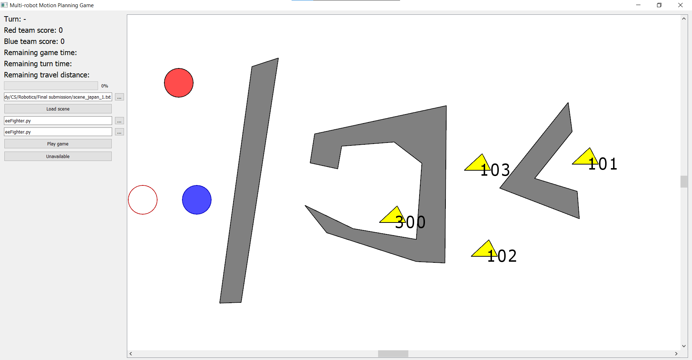

# Motion Planning Student Project

## Summary
This is a project done in a workshop course during my CS degree in Tel Aviv University. The project was done with a partner.
The game is made of 2 'robot' groups, red and blue - each has one, two or three robots. The robots are meant to collect as many coupons every turn, and get to their final positions.
Coupon have different values and the goal is to maximize the score collected before arriving at the final positions.
We were given the game framework, including the GUI, our mission was to design a motion planning algorithm to guide the robots through obstacles and collect the coupons.

During the project we were learning a lot about motion planning algorithms, mainly [RRT](https://en.wikipedia.org/wiki/Rapidly-exploring_random_tree) which was the basis for our algorithm.

See example run [here](https://www.youtube.com/watch?v=niDWkgjFa1c)


## Requirements
* Python = 3.7 (Important!)
* numpy ~= 1.20.2
* scipy ~= 1.6.1
* pip ~= 21.0.1
* PyQt5 ~= 5.15.4
* networkx ~= 2.6.3
* Microsoft Visual C++ - download and run vc_redist.x64.exe from [here](https://support.microsoft.com/en-us/help/2977003/the-latest-supported-visual-c-downloads)

## How to run

1. To run the game download the entire repository and run:
```
pyhon game.py --scene_japan_1.txt --eeFighter.py --eeFighter.py --e
```
The first parameter is the scene of the game, it can be changed to any other txt file in the folder.

## RRT and our Idea
The basic idea of RRT (Rapidly-exploring Random Tree) is to sample random point on the map space, and if they are clear of obstacles - connect them to a tree. The nodes and branches of the tree represent a valid path for the robots.


Our algorithm was based on:
1. Modification of RRT: 
    * sampling around areas of interest like coupons, enemy robots and final positions.
    * Dynamically revalidating the tree to avoid collisions with moving robots.
    
2. Component connection:
    * Throughout the game a function called 'connect_components' analyses the existing motion tree - using graph algorithms (finding connectivity components, shortest path).
    Then we attempt to connect several components - thus opening entirely new paths for the robots to follow, without sampling new points on the map.
      
3. Shortcutting, path-smoothing and fuel management:
    * Each turn begins with a certain amount of 'fuel' - thus limiting the robot movement. Based on proximity, coupon values and obstacle placement we try to evaluate the most efficient way for the robots.
    * We learned that many times paths become overcomplicated from oversampling certain areas, so before committing to a path we generated a shortcut function to try and smoothen and shorten the path if possible.
    * We experimented with several path-smoothing algorithms available online.